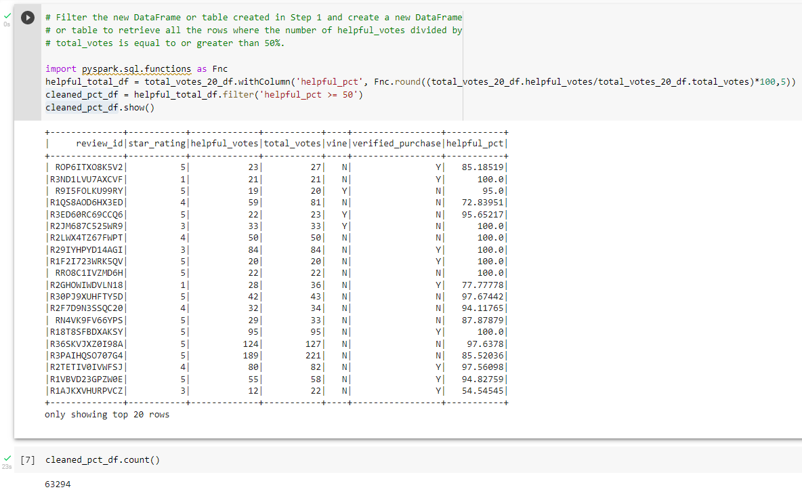
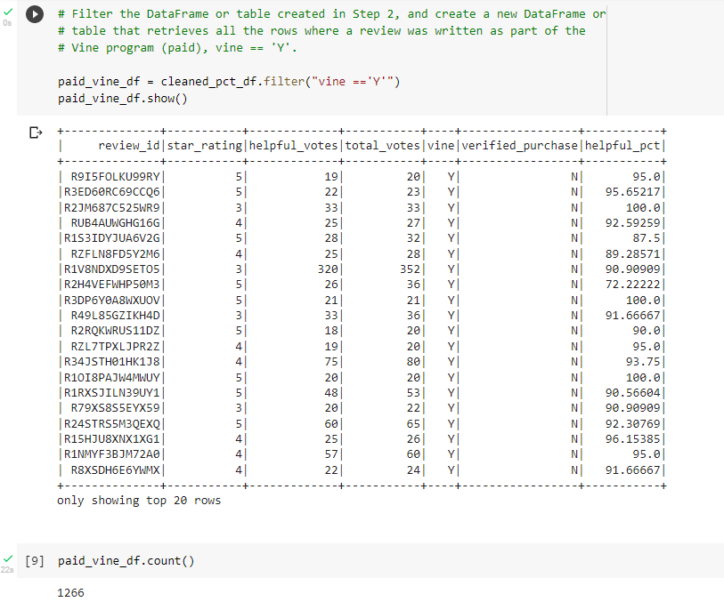
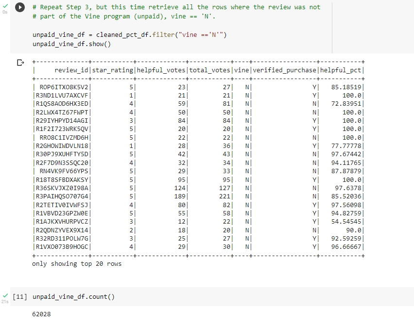
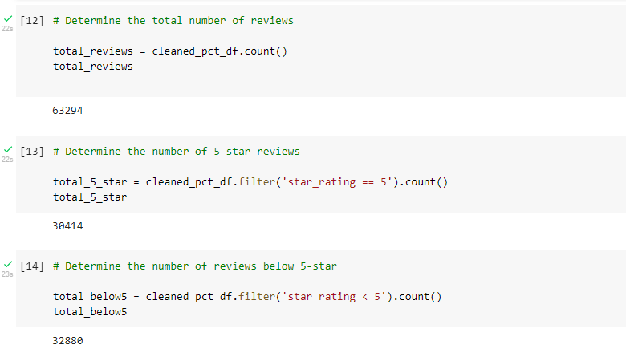
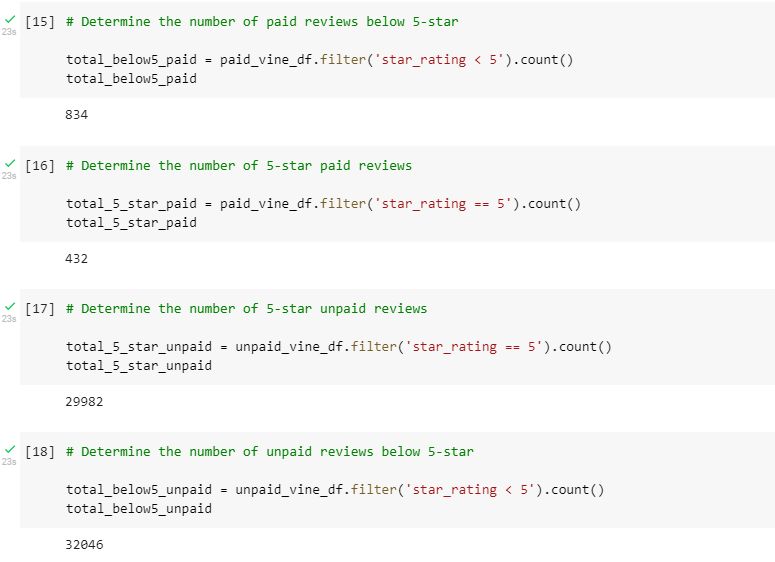
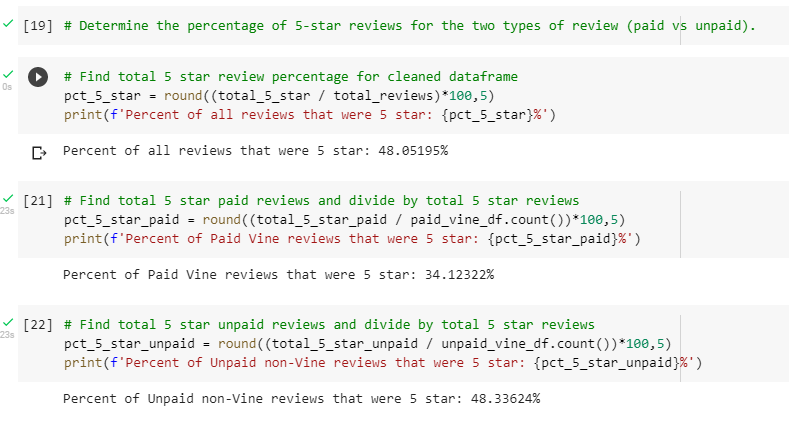

# Amazon_Vine_Analysis

## Overview

### Analyzing Amazon reviews written by members of the paid Amazon Vine program.

The Amazon Vine program is a service that allows manufacturers and publishers to receive reviews for their products. Companies like SellBy pay a small fee to Amazon and provide products to Amazon Vine members, who are then required to publish a review.

In this project, we have access to approximately 50 datasets. Each one contains reviews of a specific product, from clothing apparel to wireless products. I picked the Amazon dataset for toys, then performed ETL on this data using AWS, Google Colaboratory, PostgreSQL, and PySpark. After that, I took a closer look at one of the tables made during the ETL phase regarding the vine reviews to determine if there was any bias for positivity in the reviews in the Vine Program.

## Results

The Toys product category data set was used for this analysis.

How many Vine reviews and non-Vine reviews were there?
- Total Vine reviews: 1,266
- Total non-Vine reviews: 62,028

How many Vine reviews were 5 stars? How many non-Vine reviews were 5 stars?
- 5-star Vine reviews: 432
- 5-star non-Vine reviews: 29,982

What percentage of Vine reviews were 5 stars? What percentage of non-Vine reviews were 5 stars?
- Percentage of 5-star Vine reviews: 34.12322%
- Percentage of 5-star Non-Vine reviews: 48.33624%

### Grand Total:
- Percentage of all reviews that were 5-star: 48.05195%

The table below shows the results of the analysis:

| | Paid Review (Vine) | Unpaid (Not Vine) | Total |
| ------------: | -------------: | ------------: | ------------: |
| 5 Star | 432  | 29,982 |  30,414 |
| Less than 5 Star | 834 | 32,046 | 32,880 |
| Total  | 1,266 | 62,028 | 63,294 |
| 5-Star Percentage | 34.12 % | 48.34 % | 48.05 % |

## Summary

When we analyze the product reviews in the Toys category, a definite bias of paid Vine member reviews was present, but not what was expected. Although there were many more Paid Vine reviewers as opposed to Unpaid reviewers (1,266 vs. 62,028), Paid Vine reviewers tended to review towards less than 5-star (34.12322 %), as opposed to Unpaid reviewers who gave 5-stars more times (48.33624 %).

Based on this sampling, it is unclear if the Paid Vine reviewers were more brutal in their assessments or if this was merely a statistical peculiarity. We should dig deeper into the reviews to get a better idea of what the reviewers' assessments.

## Recommendations for Further Analysis

- For this assignment we are only assessing 5-star reviews as opposed to all the reviews. For example, we can create a frequency dataframe of Paid Vine reviews vs Unpaid for each number of stars (5,4,3,2,1) against the total reviews to drill further down into the data.

- A simpler analysis would be to assess the balance of Paid Vine vs. Unpaid reviews that were positive or 5-star and compare to reviews that were negative or 1- or 2-stars only.

- Additionally, Natural Language Processing (NLP) could be used to further analyze the sentiments of each reviewer for further fidelity in understanding customer views of various products.

